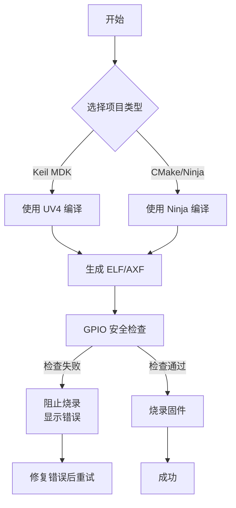
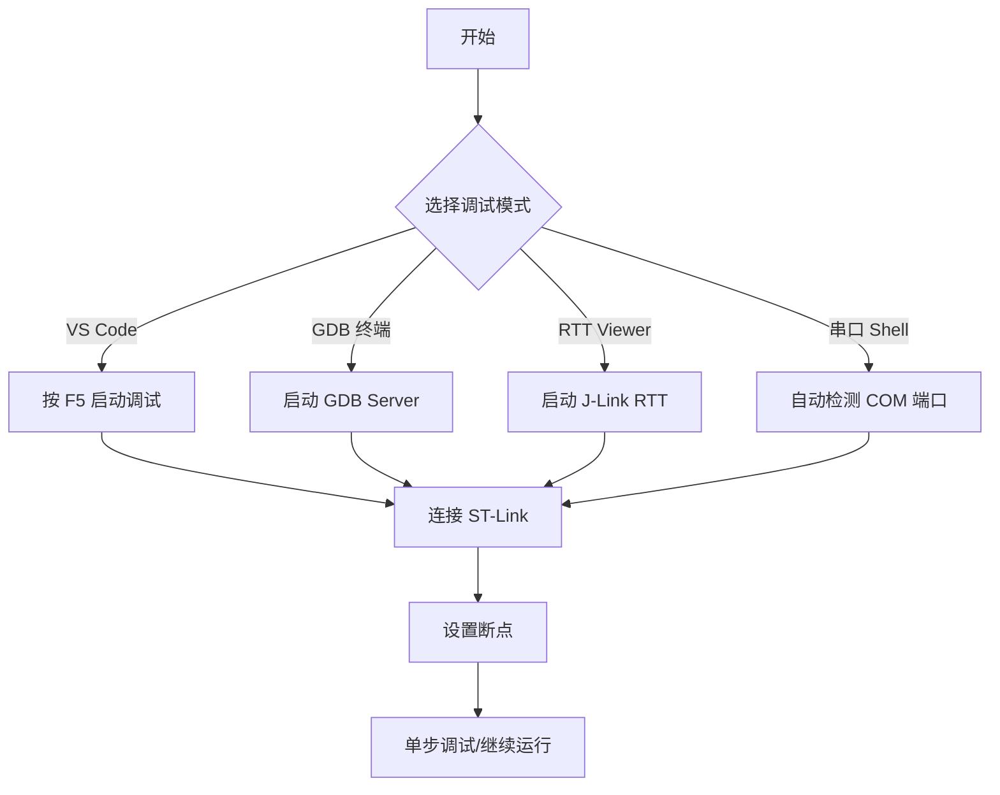
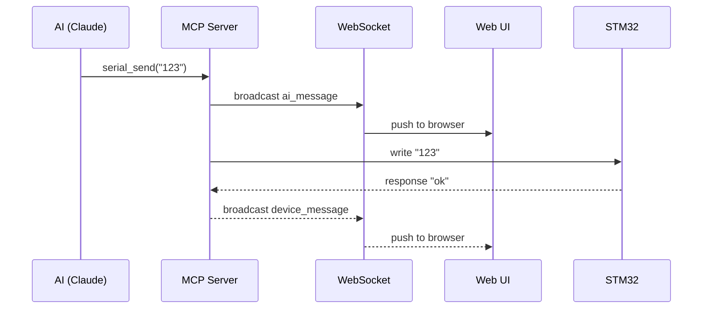

# STM32 Developer's Toolkit

### 编译 · 烧录 · 调试 · 串口监控

---

> 面向嵌入式开发者的完整工具链，一键编译烧录、GPIO 安全检查、GDB 调试、串口监控

[快速开始](#快速开始) · [功能特性](#功能特性) · [工作流程](#工作流程) · [工具链](#工具链) · [常见问题](#常见问题)

---

## 功能特性

### 🚀 一键编译 + 烧录
PowerShell 脚本自动执行编译、GPIO 检查、烧录，无需手动操作

### 🔍 GPIO 安全检查
烧录前自动检测 GPIO 配置，防止硬件损坏

### 🎯 多模式调试
| 模式 | 说明 |
|------|------|
| VS Code | 按 F5 启动图形化调试 |
| GDB 终端 | 命令行调试 |
| RTT Viewer | J-Link RTT 实时日志 |
| 串口 Shell | 自动化测试 |

### 🔌 串口监控 (MCP)
AI 直接通过 MCP 协议控制串口，实时收发数据

### 📊 Web UI 监控
浏览器可视化串口数据，支持 WebSocket 实时推送

---

## 快速开始

### 编译 + 烧录

```powershell
# 基本用法
.\scripts\build_flash.ps1 -ProjectDir "F:\path\to\project"

# 跳过安全检查（危险!）
.\scripts\build_flash.ps1 -ProjectDir "F:\path\to\project" -SkipSafetyCheck
```

### GPIO 安全检查（可独立运行）

```powershell
.\scripts\check_gpio_safety.ps1 -ProjectDir "F:\path\to\project"
```

### 启动调试

```powershell
.\scripts\start_debug.ps1 -ProjectDir "F:\path\to"           # VSCode 调试
.\scripts\start_debug.ps1 -ProjectDir "F:\path\to" -GDBClient  # GDB 终端
.\scripts\start_debug.ps1 -ProjectDir "F:\path\to" -RTT      # RTT Viewer
.\scripts\start_debug.ps1 -ProjectDir "F:\path\to" -Shell     # 串口 Shell
```

### 串口监控

```powershell
# 启动 Web UI
node monitors/serial_monitor_ai.js --serial COM11 --baud 115200 --port 8080

# 访问 http://localhost:8080
```

> **Tip:** AI 可直接使用 MCP 工具控制串口，无需手动操作

---

## 工作流程

### 编译 + 烧录流程



### 调试流程



### 串口监控架构



---

## 项目结构

```
stm32_master/
├── scripts/              # 编译、烧录、调试脚本
│   ├── build_flash.ps1       # 一键编译+烧录
│   ├── start_debug.ps1       # 启动调试会话
│   └── check_gpio_safety.ps1 # GPIO 引脚安全检查
├── monitors/             # 串口监控工具
│   ├── serial_monitor_ai.js  # MCP 服务端
│   ├── serial_monitor.js     # Web UI 串口服务
│   ├── monitor_web.ps1       # Web UI 启动脚本
│   └── package.json          # Node.js 依赖
├── docs/                 # 文档
│   ├── MONITOR_QUICKSTART.md # 监控快速入门
│   ├── MCP_CONFIG.md         # MCP 配置指南
│   └── PROJECT_SUMMARY.md    # 项目概述
└── templates/             # 代码模板
    ├── fal_module.h/.c       # FAL 模块框架
    ├── device_uart.c         # UART 驱动
    ├── device_gpio.c         # GPIO 驱动
    └── .clang-format.tmpl    # 格式化配置
```

---

## 工具链

自动检测（来自 STM32Cube bundles）：

| 工具 | 路径 |
|------|------|
| CMake | `%LOCALAPPDATA%\stm32cube\bundles\cmake\*\bin\cmake.exe` |
| STM32_Programmer_CLI | `%LOCALAPPDATA%\stm32cube\bundles\programmer\*\bin\STM32_Programmer_CLI.exe` |
| arm-none-eabi-gdb | `%LOCALAPPDATA%\stm32cube\bundles\gnu-gdb-for-stm32\*\bin\arm-none-eabi-gdb.exe` |
| ST-LINK_gdbserver | `%LOCALAPPDATA%\stm32cube\bundles\stlink-gdbserver\*\bin\ST-LINK_gdbserver.exe` |
| Keil UV4 | `D:\keil5\UV4\UV4.exe`（可配置） |

---

## GDB 调试命令

```bash
target remote localhost:61234    # 连接调试器
file build/Debug/test2.elf     # 加载符号文件
break main                      # 设置断点
continue                        # 运行
next                            # 单步
print <var>                     # 打印变量
info registers                  # 查看寄存器
```

---

## 常见问题

| 问题 | 解决方案 |
|------|---------|
| `No ST-Link found` | 检查 USB 连接 |
| `ELF not found` | 先执行编译 |
| 串口端口被占用 | 关闭其他串口程序（XCOM、串口助手等） |
| `Keil UV4 not found` | 检查 `D:\keil5\UV4\UV4.exe` 或用 `-UV4Path` 指定 |
| Web 端口 8080 被占用 | 用 `-Port` 指定其他端口 |

---

## 硬编码路径提示

| 工具 | 默认路径 | 覆盖方式 |
|------|---------|---------|
| Keil UV4 | `D:\keil5\UV4\UV4.exe` | `-UV4Path` 参数 |
| Web UI 端口 | `8080` | `-Port` 参数 |

---

## 模板文件

`templates/` 目录下包含代码生成模板：

| 模板 | 用途 |
|------|------|
| `fal_module.h/.c` | FAL 业务模块框架 |
| `device_uart.c` | UART 设备驱动 |
| `device_iic.c` | I2C 设备驱动 |
| `device_spi.c` | SPI 设备驱动 |
| `device_gpio.c` | GPIO 设备驱动 |
| `device_adc.c` | ADC 设备驱动 |
| `device_tim.c` | 定时器/PWM 驱动 |
| `device_can.c` | CAN 设备驱动 |

---

## 静态检查

```bash
# 安装 clang-format
winget install LLVM.LLVM

# 格式化代码
clang-format -i Core/Src/main.c

# 静态检查
winget install cppcheck.cppcheck
cppcheck --enable=warning,style fal/ common/
```

---

## 验证组件

| 组件 | 版本 |
|------|------|
| CMake | 4.2.3+st.1 |
| STM32_Programmer_CLI | 2.22.0+st.1 |
| arm-none-eabi-gdb | 14.3.1+st.2 |
| ST-LINK_gdbserver | 7.13.0+st.3 |
| Keil UV4 | 5.25.2+ |
| 芯片 | STM32F103 High-density |

---

## 占位符

代码模板中使用的占位符：

| 占位符 | 说明 |
|--------|------|
| `{{MODULE_NAME}}` | 模块名（小写） |
| `{{MODULE_NAME_UPPER}}` | 模块名（大写） |
| `{{DATE}}` | 当前日期 |
| `{{DEVICE}}` | 芯片型号 |
| `{{TARGET}}` | 项目名称 |
| `{{INTERFACE}}` | 调试接口（SWD/JTAG） |